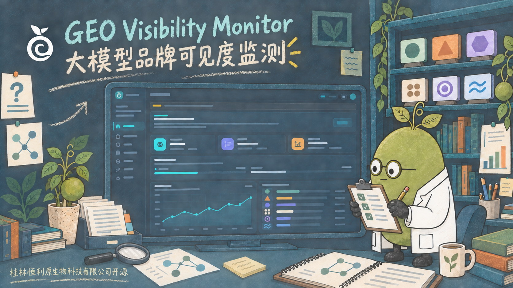
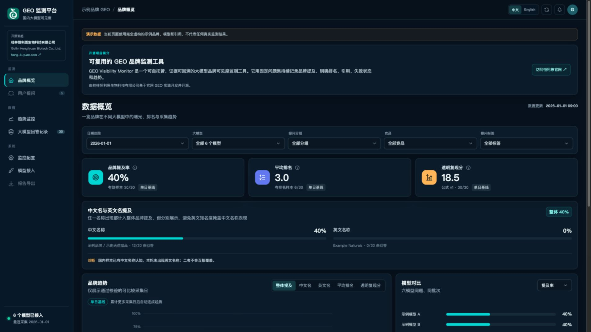
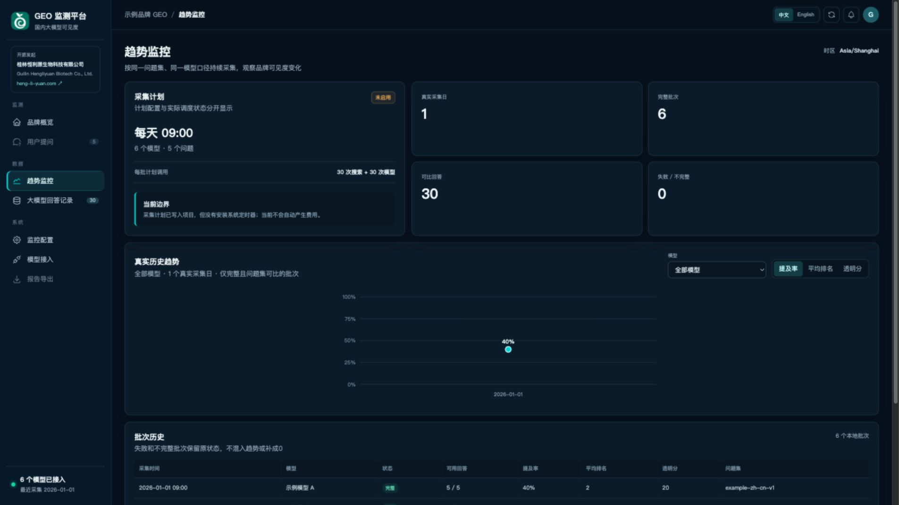
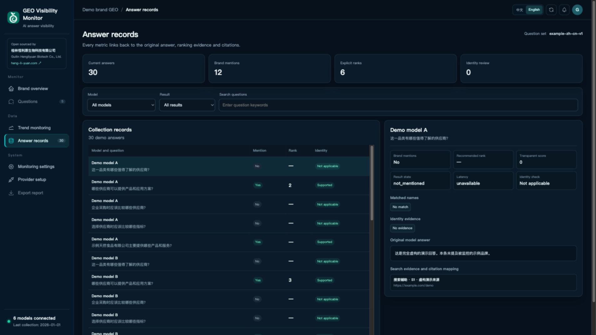

# GEO Visibility Monitor

[English](#english) · [中文](#中文)

<p align="center"></p>

<p align="center"><a href="https://briton2008.github.io/geo-visibility-monitor/">在线演示 / Live demo</a></p>



## 中文

一个可自托管、证据可回溯的 GEO（生成式引擎可见度）监测工具。它用固定问题集向多个 OpenAI-compatible 模型发起同题采集，分开记录品牌提及、明确排名、名称语言、引用来源、失败状态和历史趋势。

它适合持续运行而不是一次性检测：可按日、按周或手动采集，由本地计划任务或 Agent 代管执行、异常诊断与报告生成。API 密钥、付费和发布权限仍由使用者掌控。

本项目由 **[桂林恒利原生物科技有限公司](https://heng-li-yuan.com/)**（**Guilin Hengliyuan Biotech Co., Ltd.**）在官网 GEO 实践中开发，并作为可复用的通用品牌监控工具开源。Apache-2.0 适用于代码；项目标识与公司商标不因代码开源而自动授权，详见 [TRADEMARKS.md](TRADEMARKS.md)。

界面使用 MIT 许可的 [Tabler Icons](https://github.com/tabler/tabler-icons)，第三方许可见 [THIRD_PARTY_NOTICES.md](THIRD_PARTY_NOTICES.md)。

### 软件界面 / Interface

以下均为电脑端横向界面，使用虚构演示数据，不代表任何真实品牌监测结果。

**品牌概览 / Brand overview**



**趋势监控 / Trend monitoring**



**回答记录 / Answer records**



### 加入交流

扫描下方二维码加入 GEO 开源交流群，交流模型接入、监控口径和部署经验。当前二维码预计在 **2026-09-28 前有效**；到期后维护者只需替换同路径文件，README 与在线页面地址不变。

<p align="center"><a href="assets/community-wechat.jpg"></a></p>

### 当前六模型成本参考

以恒利原当前示例配置为参考：**6 个模型 × 5 个问题 × 每周 1 次**，每批约产生 30 次模型调用和 30 次联网搜索调用，按月均 4.33 周计算为约 130 次模型调用与 130 次搜索调用。

- Token 估算：每次约 3,500 输入 Token；根据首轮保存的回答长度，平均可见输出约 900–1,700 Token。
- 模型费用：默认选用 Flash/Lite/Turbo，并关闭可选的深度思考；约 **¥1.70/月**。Kimi 使用支持非思考模式的 Kimi-K2.5，不使用仅思考的 Kimi-K3。
- 腾讯云 WSA 搜索费用：轻量版约 **¥2.34/月**，标准版约 **¥5.98/月**。
- 综合参考：轻量版搜索约 **¥4/月**，标准版搜索约 **¥8/月**；考虑缓存、失败重试和价格变动，建议按 **¥5–10/月**准备预算。

以上为 **2026-09-21 的参考估算，不是账单或价格承诺**。免费额度尚未抵扣，最终费用以各供应商返回的 usage 与实际账单为准。页面内置预算计算器，可按自己的模型、问题数量、监控频率和最新单价重新计算。价格参考：[阿里云百炼模型价格](https://help.aliyun.com/zh/model-studio/model-pricing)、[百度千帆价格](https://cloud.baidu.com/doc/qianfan-docs/s/Jm8r1826a)、[腾讯云联网搜索 API 计费](https://cloud.tencent.com/document/product/1806/121798)。

## 安装

### 本地监控软件

```bash
git clone https://github.com/briton2008/geo-visibility-monitor.git
cd geo-visibility-monitor
python3 scripts/bootstrap.py
python3 scripts/generate_demo_data.py
python3 dashboard_server.py --host 127.0.0.1 --port 4187
```

### Claude Code

分两次发送：

```text
/plugin marketplace add briton2008/geo-visibility-monitor
```

```text
/plugin install geo-visibility-monitor@geo-visibility-monitor
```

### Codex

```bash
codex plugin marketplace add briton2008/geo-visibility-monitor
codex plugin add geo-visibility-monitor@geo-visibility-monitor
```

安装后重新启动 Codex，调用 `$geo-visibility-monitor`，或直接提出“检查我的 GEO 监控配置”。

### Gemini CLI

```bash
gemini extensions install https://github.com/briton2008/geo-visibility-monitor
```

### 其他 Agent

支持读取 `AGENTS.md` 的 Agent 可以直接从本仓库根目录运行；GitHub Copilot 会读取 `.github/copilot-instructions.md`。远程安装命令指向本公开仓库，本地软件也可直接运行。

### 能解决什么

- 同一品牌的中文名、英文名和别名分别监测，同时汇总整体提及率。
- 同一问题集跨模型、跨日期比较，问题被修改后不会悄悄续接旧趋势。
- `timeout`、限流、解析错误和 API 错误保留原状态，不补成 0。
- 每个指标可回到原始回答、引用和身份佐证。
- 提供每日、每周和手动三种监控节奏，但不会自行安装系统定时器。
- 提供调用次数与月度费用估算；没有实际单价时明确显示 `unavailable`。
- 提供百炼、火山方舟、DeepSeek、Gemini、OpenAI 及通用兼容接口的接入向导。
- 深色响应式仪表盘，支持中文 / English 界面切换。

### 5 分钟本地启动

要求 Python 3.9+，不依赖第三方 Python 包。

```bash
python3 scripts/generate_demo_data.py
python3 scripts/bootstrap.py
python3 dashboard_server.py --host 127.0.0.1 --port 4187
```

打开 <http://127.0.0.1:4187/>。初次启动只显示明确标记的虚构演示数据，不会调用任何付费 API。

### 接入自己的品牌与模型

1. 将 `config.example.json` 复制为 `config.json`（`bootstrap.py` 会自动完成）。
2. 修改品牌、别名、业务简介、官方域名和带版本的问题集。
3. 为每个模型填写 OpenAI-compatible `endpoint`、模型名和环境变量名。
4. 设置搜索与模型密钥：

```bash
export TENCENTCLOUD_WSA_APIKEY='...'
export MODEL_A_API_KEY='...'
python3 domestic_geo.py doctor
python3 domestic_geo.py run --provider provider-a
python3 build_web_data.py
```

密钥只从环境变量或 macOS 钥匙串读取，不写入报告。macOS 可通过 `GEO_KEYCHAIN_ACCOUNT` 指定钥匙串账户；未指定时使用当前系统用户名。

完整的平台开通、配置片段与排障步骤见 [PROVIDERS.md](PROVIDERS.md)。推荐先用阿里云百炼按量 API 作为国产模型聚合入口，再用火山方舟补豆包；Coding Plan 等限定编程工具的套餐不用于本项目的自动化监控。

### 指标口径

- 提及率：可用回答中出现任一已配置品牌名称的比例。
- 平均排名：只统计回答中形成明确推荐顺序且品牌有位次的样本。
- 透明复现分：`排名分 × 0.7 + 引用分 × 0.2 + 官方来源分 × 0.1`。权重可配置，公式不等同于任何第三方平台的私有评分。
- 中文名 / 英文名：分别展示，不互相覆盖。
- AI 引用与搜索可发现性：记录模型是否引用、搜索层是否发现相关来源；不据此宣称品牌已进入模型内部知识库或训练数据。

联网搜索结果只说明采集时提供给模型的证据，不自动证明来源内容真实。模型 API 回放也不等于消费端产品界面。

### 常用命令

```bash
python3 -m unittest discover -s tests -v
python3 monitoring_runner.py                 # 只检查计划，不调用 API
python3 monitoring_runner.py --execute       # 按计划实际调用
python3 monitoring_runner.py --execute --force
python3 scripts/release_check.py
```

真实运行数据、`config.json`、本地状态和生成的 `web/answer-data.js` 已加入 `.gitignore`。公开仓库只提交 `config.example.json` 和虚构的 `web/answer-data.example.js`。

## English

GEO Visibility Monitor is a self-hosted, evidence-bounded monitor for brand visibility in AI-generated answers. It runs a versioned question set across multiple OpenAI-compatible models and keeps brand mentions, explicit ranks, alias language, citations, failures and trends separately auditable.

The project was developed through website GEO work by **[Guilin Hengliyuan Biotech Co., Ltd.](https://heng-li-yuan.com/)**（**桂林恒利原生物科技有限公司**）and open-sourced as a reusable brand-monitoring tool. Apache-2.0 covers the code; project identity and company trademarks are not automatically licensed with the code. See [TRADEMARKS.md](TRADEMARKS.md).

Three landscape desktop screenshots are included in the [Interface gallery](#软件界面--interface). All screenshots use fictional demo data.

### Community

Scan the QR code in the [Chinese section](#加入交流) to join the WeChat community for integration, monitoring-methodology and deployment discussions. The current code is expected to remain valid through **2026-09-28** and can later be replaced at the same asset path without changing the public page URL.

### Six-model cost example

The current Hengliyuan example runs **6 models × 5 questions × once per week**: about 30 model calls and 30 web-search calls per batch, or roughly 130 of each in an average month.

- Token assumption: about 3,500 input tokens per call; the first saved answers contain roughly 900–1,700 visible output tokens on average.
- Model estimate: approximately **CNY 1.70/month** with Flash/Lite/Turbo models and optional reasoning disabled. The example uses non-reasoning Kimi-K2.5 rather than reasoning-only Kimi-K3.
- Tencent Cloud WSA search: approximately **CNY 2.34/month** on Lite or **CNY 5.98/month** on Standard.
- Combined reference: approximately **CNY 4/month** with Lite search or **CNY 8/month** with Standard search; keep a practical budget range of **CNY 5–10/month** for cache behavior, retries and price changes.

This is a **dated estimate as of 2026-09-21, not an invoice or price guarantee**. Free quotas are not deducted. Provider usage fields and invoices remain authoritative. The built-in calculator lets each deployment update model count, question count, cadence and current rates.

## Install

### Local monitor

```bash
git clone https://github.com/briton2008/geo-visibility-monitor.git
cd geo-visibility-monitor
python3 scripts/bootstrap.py
python3 scripts/generate_demo_data.py
python3 dashboard_server.py --host 127.0.0.1 --port 4187
```

### Claude Code

Send these as two separate commands:

```text
/plugin marketplace add briton2008/geo-visibility-monitor
```

```text
/plugin install geo-visibility-monitor@geo-visibility-monitor
```

### Codex

```bash
codex plugin marketplace add briton2008/geo-visibility-monitor
codex plugin add geo-visibility-monitor@geo-visibility-monitor
```

### Gemini CLI

```bash
gemini extensions install https://github.com/briton2008/geo-visibility-monitor
```

These remote install commands point to the public repository. Agents that read `AGENTS.md` can also use the checked-out repository directly.

### Highlights

- Track primary names, aliases and Chinese/English names separately.
- Compare the same versioned questions across models and dates.
- Preserve timeout, rate-limit, parse and API errors instead of turning them into zeros.
- Trace each metric back to the original answer and citation metadata.
- Configure daily, weekly or manual collection without silently installing a scheduler.
- Responsive dark dashboard with Chinese / English UI.
- Built-in call and monthly budget estimator with explicit unavailable states.
- Provider setup guide for Bailian, Ark, DeepSeek, Gemini, OpenAI and compatible endpoints.

### Quick start

Python 3.9+ is required. There are no third-party Python runtime dependencies.

```bash
python3 scripts/generate_demo_data.py
python3 scripts/bootstrap.py
python3 dashboard_server.py --host 127.0.0.1 --port 4187
```

Open <http://127.0.0.1:4187/>. The first run uses clearly labelled synthetic demo data and makes no paid API calls.

Copy and edit `config.example.json`, then provide the configured search and model API keys through environment variables or the macOS Keychain. Run `python3 domestic_geo.py doctor` before the first real collection.

See [PROVIDERS.md](PROVIDERS.md) for provider-specific setup, endpoint examples and troubleshooting.

The transparent score is public and configurable: `rank component × 0.7 + citation component × 0.2 + official-source component × 0.1`. It does not reproduce any third-party proprietary score.

See [CONTRIBUTING.md](CONTRIBUTING.md) for development and [SECURITY.md](SECURITY.md) for vulnerability reporting and safe local deployment.

## License

Apache-2.0. See [LICENSE](LICENSE).
